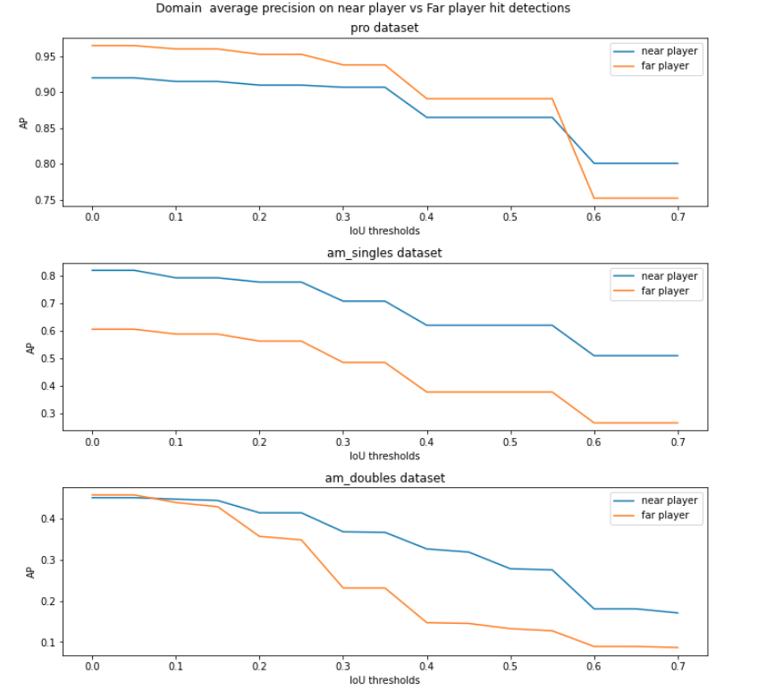

# Detecting shuttlecock hit events in professional and amateur badminton videos

In this project, we develop a hit detection algorithm to detect hits in generic monocular videos, agnostic to camera angle and player skill level. We propose to use badminton domain features (court, pose and shuttlecock coordinates) as input to a GRU based model. These coordinates are extracted from each frame, and a sequence of coordinates from 14 consecutive frames is fed into the GRU model to predict three classes: 'no hit', 'hit by near player', or 'hit by far player'. During training, we consider a sequence of 14 frames to be a hit, if a hit is found in the last six frames.

## Contributions
1. We find that our proposed method, even though it is only trained with professional broadcast singles videos, is able to generalize to some extent to amateur videos taken from different camera angles, doubles games, and players of different skill levels. This validates the robustness of badminton domain features (coordinate form) over generic RGB features.
2. We provide annotated datasets of professional singles, amateur singles and amateur doubles matches . 
3. We provide manual annotation tools to faciliate annotation of custom datasets under the datasets/ directory.
4. We provide a semi-automatic annotation pipeline in the annotation_pipeline/ directory.

## Demo
Below, we show a few demos of our proposed hit detection algorithm on videos of different camera angles, players of different skill levels, singles and doubles videos.

### Professional video:

### Amateur singles video:

### Amateur doubles video:

## Datasets
We prepare three sets of annotated matches: Professional singles, amateur singles, amateur doubles. They are available in this  and should be placed under the datasets/ directory.

We provide ground-truth annotations of shuttlecock coordinates, hit detections, and player bounding boxes. We also provide manual annotation tools under datasets/.

## Evaluation
We compare our proposed methods with two baselines, a ResNet image classifier and a rule-based baseline based on comparing the second derivative of the shuttlecock x and y coordinates with an empirically determined threshold. We use mAP as the evaluation metric (see report for more information).

### Performance at various IoU thresholds

#### Different methods, same dataset

#### Different datasets, same method

#### Detecting near player hits vs far player hits

### Qualitative analysis of strengths and weaknesses
Check out these videos for a demonstration of various qualities:
- Mixing up of near and far player hits when camera angle is too wide
  - 
  - 
- Robustness to occluded shuttlecock/ poses
  - shuttlecock occluded, rule-based fails but domain works
    - 
    - 
  - pose occluded, resnet fails but domain works
    - 
    - 
  - Able to tell there is no hit, even when player performs hit action halfway but stops when he realises shuttlecock is going out of court
    

## Usage
1. Rally videos and their ground-truth annotations are provided under datasets/ in pro.zip, am_singles.zip, am_doubles.zip, or can be downloaded 
2. Manual annotation tools are provided under datasets/ in the scripts label_tool_bbox.py, label_toolV2.py
3. Semi-automatic annotation pipeline for pose and shuttlecock coordinates are in annotation_pipeline/
3. Notebooks for organising datasets into input features and observing dataset statistics can be found in annotation_pipeline/organise_input_features.ipynb and annotation_pipeline/dataset_stats.ipynb
4. Notebooks for training the proposed domain based algorithm and ResNet are found in domain_rnn.ipynb and ResNet_baseline.ipynb respectively. They take in input features from the directory input_features/
5. Notebooks for processing classification probabilities from the proposed algorithms can be found in hit_detection/process_pred_probs.ipynb
6. The notebook for rule-based baseline method can be found in hit_detection/rule_baseline.ipynb
7. Pretrained weights for the proposed domain method can be found in mm_weights/
8. Pretrained weights for ResNet can be found in resnet_data

A small GPU is required for running the semi-automatic annotation pipeline, as well as for training the proposed GRU network and ResNet. The computational load is fairly light, see details in the training notebooks.

## References
The following references were immensely useful for this project.
1. 
on using badminton domain features for hit event detection
2.  on tracking shuttlecock with deep learning, as well as providing the TrackNetv2 dataset which formed the basis of our Professional dataset.

## Full report
The full details are documented in the pdf report.

## Future directions
1. Domain Adaptation to improve generalisation.
2. Multimodal feature learning, possibly combine audio and rgb features with domain coordinates.
3. Larger and more varied training dataset.
4. Extension to other aspects of badminton video analysis, including stroke classification, strategy analysis etc.